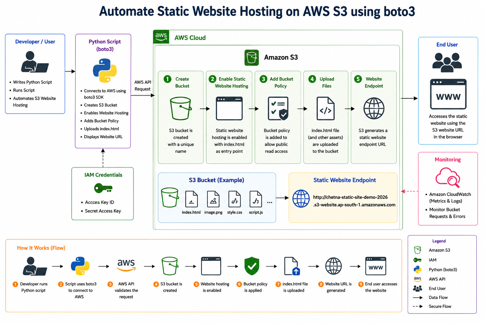
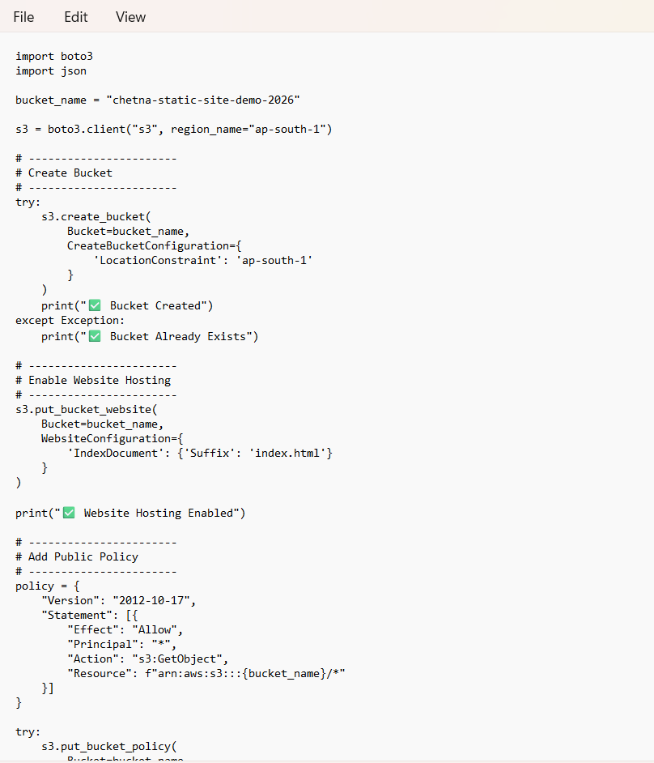
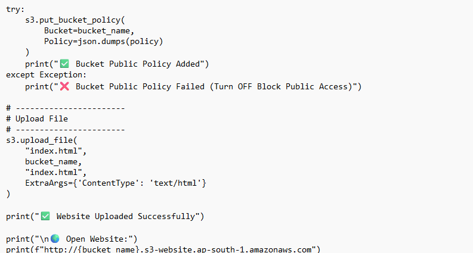
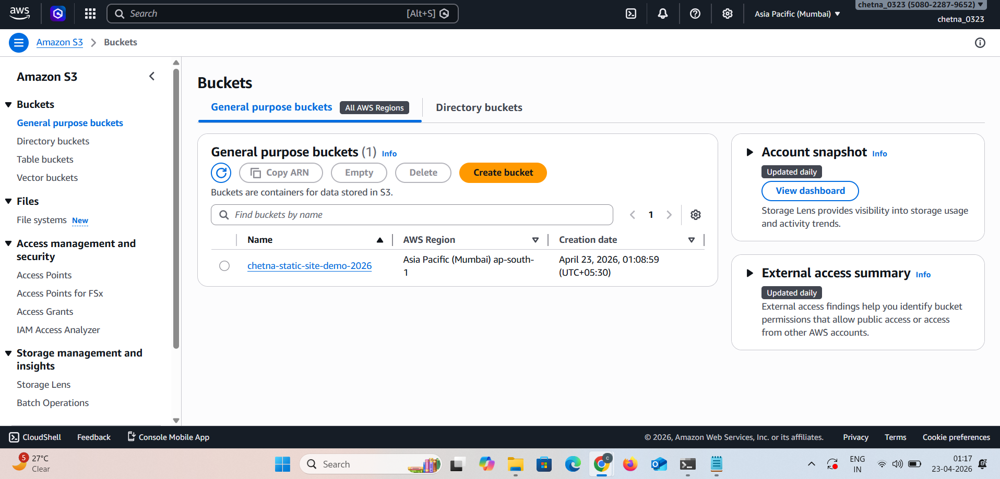
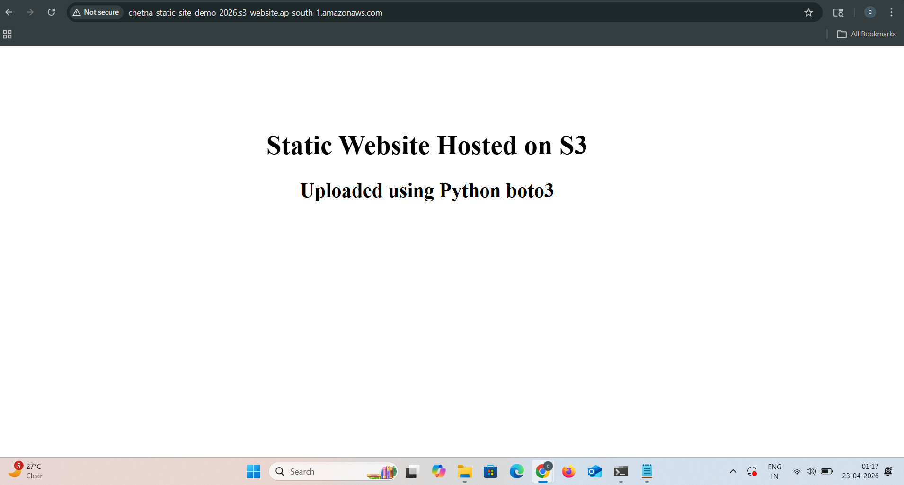
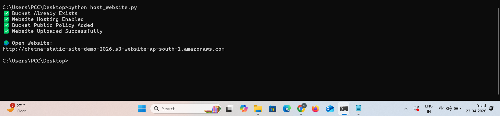

🚀 Automate Static Website Hosting on AWS S3 using boto3


---

📌 Project Overview

This project demonstrates how to **automate static website hosting on AWS S3** using Python and the **boto3 SDK**.

The entire process is automated using a Python script — no manual AWS Console steps required.

---

🎯 Purpose

- Automate AWS resource creation  
- Avoid manual configuration  
- Deploy static website quickly  
- Learn Infrastructure as Code (IaC)  

---

🧰 AWS Services Used

- Amazon S3  
- AWS IAM  
- Python boto3  

---

🏗️ Architecture Diagram



**Flow:**

Developer → Python Script → AWS S3 → Static Website → End User  

---

💻 Python Automation Script

🧾 Part 1


🧾 Part 2


This script performs:

- Creates S3 bucket  
- Enables static website hosting  
- Adds public access policy  
- Uploads `index.html`  
- Generates website URL  

---

📦 S3 Bucket Created



The S3 bucket is successfully created in the specified region using boto3.

---

🌐 Website Output



The static website is successfully hosted and accessible via the S3 endpoint.

---

⚙️ Script Execution Output



The terminal confirms:
- Bucket creation  
- Hosting enabled  
- Policy added  
- File uploaded successfully  

---

🔥 Key Features

- Fully automated deployment  
- No manual AWS Console usage  
- Static website hosting on S3  
- Public access configuration  
- Fast and reusable  

---

📁 Project Structure

```
S3-Static-Website-Automation/
│── host_website.py
│── index.html
│── README.md
│── screenshots/
│    ├── architecture.png
│    ├── code1.png
│    ├── code2.png
│    ├── s3-bucket.png
│    ├── website.png
│    ├── output.png
```

---

🧠 How It Works

1. Run Python script  
2. boto3 connects to AWS  
3. S3 bucket is created  
4. Website hosting is enabled  
5. Public policy is applied  
6. HTML file is uploaded  
7. Website becomes live  

---

⚠️ Important Notes

- Disable **Block Public Access** in S3  
- Use valid AWS credentials (IAM user)  
- Bucket name must be globally unique  

---

✅ Conclusion

This project shows how **boto3 (AWS SDK)** can automate infrastructure and deploy a **static website efficiently**.

It reduces manual effort and demonstrates a basic **Infrastructure as Code approach using Python**.

---
